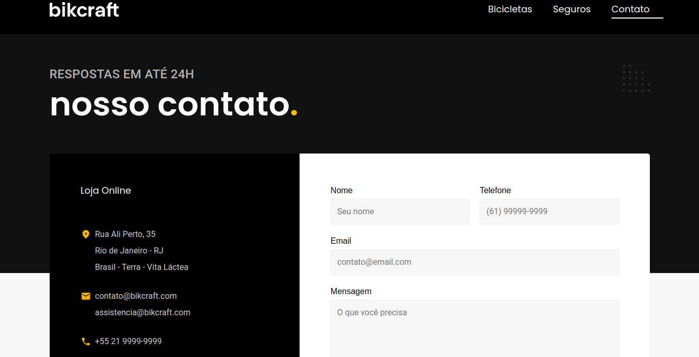

<h1 align="center">
  
</h1>

## About

The Bikcraft project was developed in the last module of Origamid's HTML and CSS for Beginners course, with a little JavaScript for some basic functionality. This is a professional and totally responsive website for the fictional brand Bikcraft, whose main product is electric bikes specifically tailored for each person.

<h1 align="center">
  
</h1>

<h1 align="center">
  
</h1>

<h1 align="center">
  
</h1>

<h1 align="center">
  
</h1>

<h1 align="center">
  
</h1>

<h2 align="center"><a href="https://loja-bikcraft.netlify.app/">See the site</a></h2>

## Technologies used

<table>
  <tr>
    <td>Semantic <strong>HTML5</strong> markup<td>
  <tr>
    <td><strong>CSS</strong><td>
  <tr>
    <td>Flexbox<td>
  <tr>
    <td><strong>CSS</strong> Grid<td>
  <tr>
    <td><strong>JavaScript</strong> and plugin of simple anime<td>
</table>
