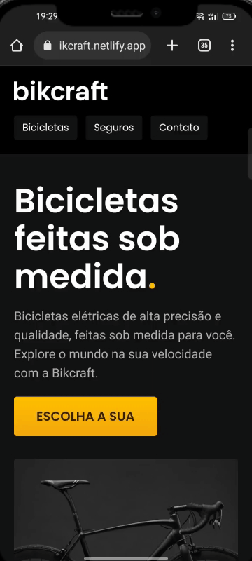
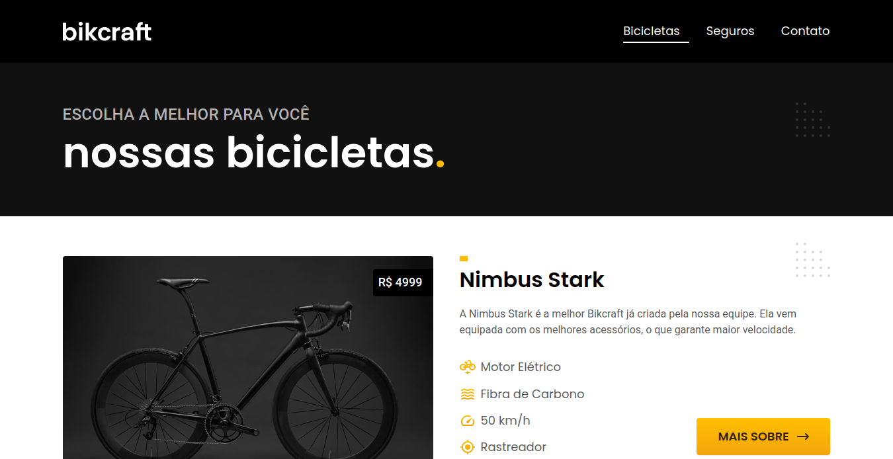
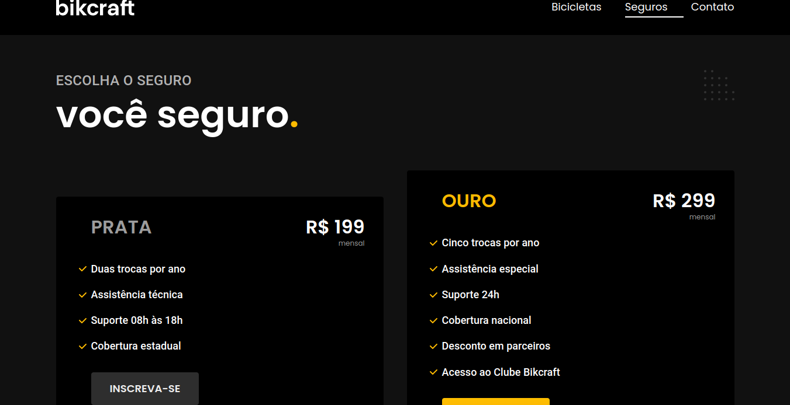

<h1 align="center">
  
</h1>

## About

The Bikcraft project was developed in the last module of Origamid's HTML and CSS for Beginners course, with a little JavaScript for some basic functionality. This is a professional and totally responsive website for the fictional brand Bikcraft, whose main product is electric bikes specifically tailored for each person.

---

  
  

  <h1></h1>
  <h1></h1>
  <h1></h1>
  <h2 align="center"><a href="https://loja-bikcraft.netlify.app/">See the full site</a></h2>

## Technologies used

<table>
  <tr>
    <td>Semantic <strong>HTML5</strong> markup<td>
  </tr>  
  <tr>
    <td><strong>CSS</strong><td>
  </tr>  
  <tr>
    <td>Flexbox<td>
  </tr>  
  <tr>
    <td><strong>CSS</strong> Grid<td>
  </tr>  
  <tr>
    <td><strong>JavaScript</strong> and plugin of simple anime<td>
  </tr>  
</table>

Made with ❤️ by Gabriel Lopes

[See my Linkedin](https://www.linkedin.com/in/gabriellopes-silva/)
